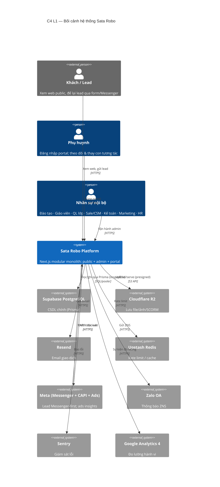

# 3. Phạm vi & Bối cảnh — C4 Level 1 (System Context)

> arc42 §3 — *Context and Scope* · **C4 Level 1**. Hệ thống Sata Robo nằm ở đâu, ai dùng, kết nối với hệ thống ngoài nào.

## 3.1 Sơ đồ bối cảnh (C4 System Context)

:::note Học viên không có tài khoản riêng
**Học viên** học offline và **không có đăng nhập riêng** (scope đã loại). Mọi mặt học-viên-facing nằm trong **portal của phụ huynh** — xem [§6 Học viên](/06-runtime-luong/hoc-vien).
:::

## 3.2 Bối cảnh người dùng (chi tiết)

| Tác nhân | Loại | Tương tác chính |
|---|---|---|
| Khách / Lead | ngoài | Xem public, gửi lead (form/Messenger) |
| Phụ huynh (`PARENT`) | người dùng | Portal: học phí, lịch, bài tập/thi, học bạ, ảnh, yêu cầu |
| Nhân sự nội bộ | người dùng | Admin: CRM, lớp, điểm danh, chấm bài, tài chính… (9 vai trò RBAC) |
| Học viên | gián tiếp | Làm bài/thi **qua tài khoản phụ huynh** (cookie `portal_view`) |

## 3.3 Hệ thống ngoài (external systems)

| Hệ thống | Vai trò | Ràng buộc |
|---|---|---|
| Supabase PostgreSQL | CSDL chính | Dùng **pooler** (IPv6 quirk) |
| Cloudflare R2 | Object storage | Presigned URL; CORS cho SCORM |
| Resend | Email | Qua email queue (cron) |
| Upstash Redis | Rate limit | — |
| Meta | Lead + Ads | Webhook + CAPI **chỉ qua** `modules/integration` |
| Zalo OA | Thông báo | — |
| Sentry / GA4 | Quan sát/đo lường | server+edge / client |

→ Cách các container nội bộ kết nối các hệ ngoài này: [§5 Khối xây dựng](/05-khoi-xay-dung) và [§7 Triển khai](/07-trien-khai).
