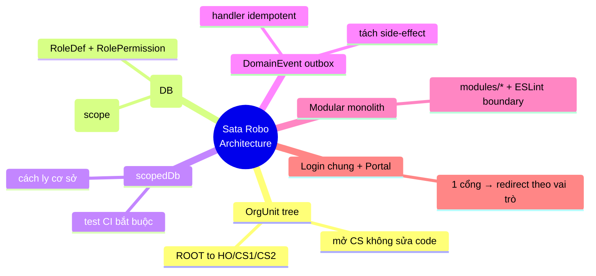

# 4. Chiến lược giải pháp

> arc42 §4 — *Solution Strategy*. Các quyết định nền tảng giải quyết mục tiêu chất lượng ở [§1](/01-gioi-thieu-muc-tieu).

## 4.1 Quyết định nền tảng

| Mục tiêu (§1) | Chiến lược | Cơ chế |
|---|---|---|
| Cách ly cơ sở | `scopedDb(actor)` ép `centerId ∈ visibleCenterIds` | [§8](/08-khai-niem-xuyen-suot) |
| Toàn vẹn tiền/ghi danh | Atomic transaction cho tiền+enrollment; side-effect tách ra event | DomainEvent outbox |
| Quyền tối thiểu | RBAC theo hành động: `can()` tĩnh + RBAC động DB | RoleDef/RolePermission/UserOrgRole |
| Mở rộng tổ chức | **OrgUnit tree** (ROOT → HO/CS1/CS2…) | Mở CS = thêm data |
| Hiệu năng public | Server-first RSC + ISR; animation tối giản | [§10](/10-yeu-cau-chat-luong) |
| Tách module | **Modular monolith** + ESLint boundary | `modules/*` (đích) |

## 4.2 Sáu trụ kiến trúc (Blueprint Doc 15)

## 4.3 Quy tắc Atomic vs Event

- **Trong transaction** (atomic): tiền · invoice · enrollment · kho.
- **Qua DomainEvent** (bất đồng bộ, idempotent): thông báo · thống kê · đồng bộ ngoài · auto-homework.
- **External call** (Resend/Zalo/MISA/Meta/CAPI/GA4): **chỉ** qua `modules/integration`.

## 4.4 Hướng chuyển dịch (additive trước, drop sau)

Hệ thống nâng cấp **dần** theo phase A0 → R5; thêm cột/relation mới (giữ cũ nullable) → ổn định → mới drop. Khi xây mới theo Blueprint Doc 15; khi xung đột "hiện trạng" vs Doc 15 → **Doc 15 thắng cho việc xây mới**.

→ Các quyết định cụ thể được ghi dưới dạng ADR tại [§9](/09-quyet-dinh-kien-truc).
