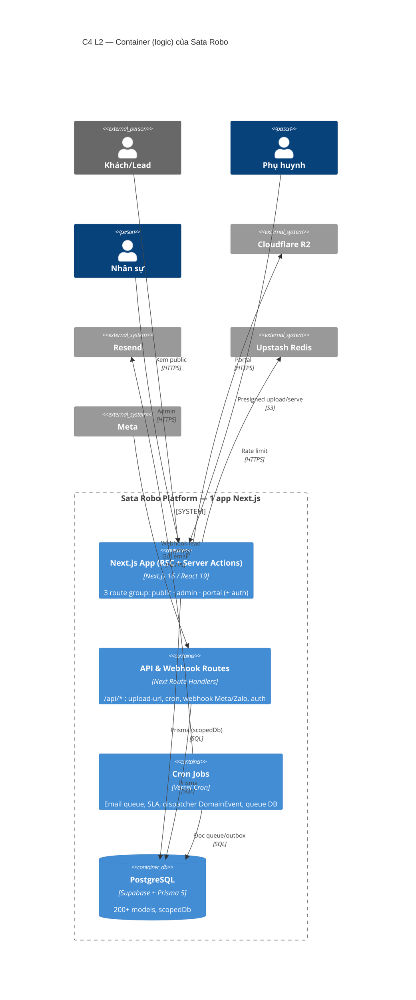
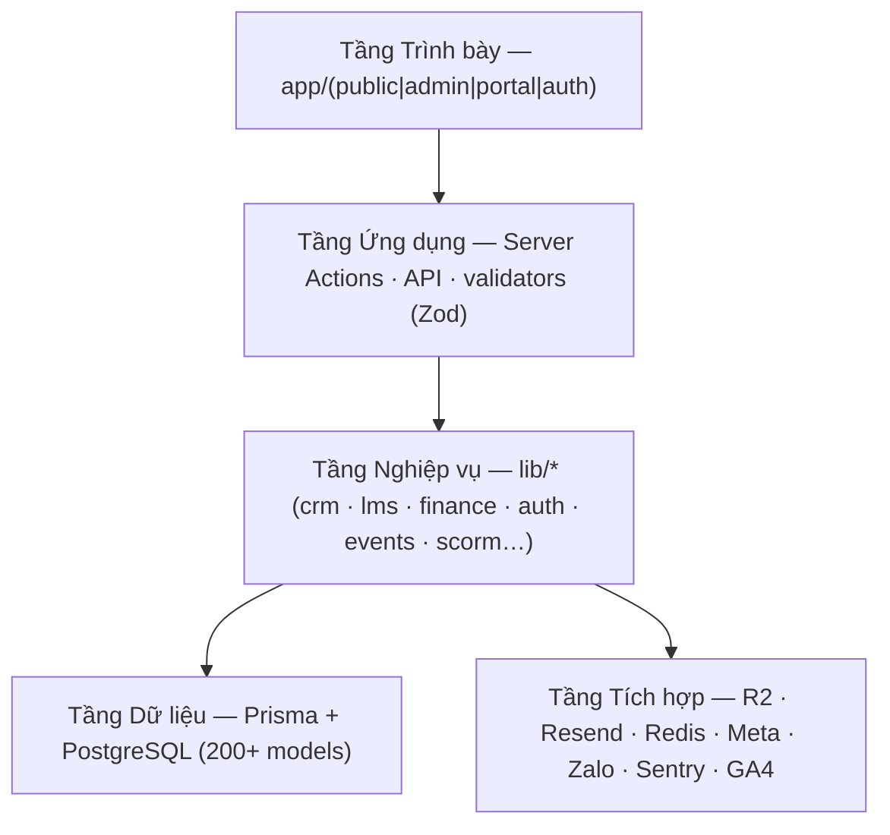

# 5. Khối xây dựng — C4 Level 2 & 3

> arc42 §5 — *Building Block View* · **C4 Level 2 (Container)** + **Level 3 (Component)**. Phân rã hệ thống theo **5 tầng**.

## 5.1 Sơ đồ Container (C4 L2)

## 5.2 Phân rã theo 5 tầng

| Tầng | Thư mục chính | Trách nhiệm | Trang |
|---|---|---|---|
| **Trình bày** | `app/(public\|admin\|portal\|auth)`, `components/*` | RSC + client components, render UI, host-based routing | [→ Tầng Trình bày](./tang-trinh-bay) |
| **Ứng dụng** | `*/actions.ts`, `app/api/*`, `lib/validators/*` | Server Actions, API routes, xác thực Zod, gọi nghiệp vụ | [→ Tầng Ứng dụng](./tang-ung-dung) |
| **Nghiệp vụ** | `lib/{crm,lms,finance,auth,events,scorm,…}` | Logic miền, quy tắc, transaction, DomainEvent | [→ Tầng Nghiệp vụ](./tang-nghiep-vu) |
| **Dữ liệu** | `prisma/`, `lib/db.ts`, `lib/db-scope.ts` | Schema, migration, truy vấn, cách ly cơ sở | [→ Tầng Dữ liệu](./tang-du-lieu) |
| **Tích hợp** | `lib/{storage,email,crm/meta-*}`, `modules/integration` | Cổng ra hệ ngoài | [→ Tầng Tích hợp](./tang-tich-hop) |

:::info 🚧 Khung
Mỗi trang tầng đang ở mức **khung** (mục đích + sơ đồ component skeleton + file chính). Bước 2 sẽ chi tiết hoá từng component & từng tính năng.
:::
