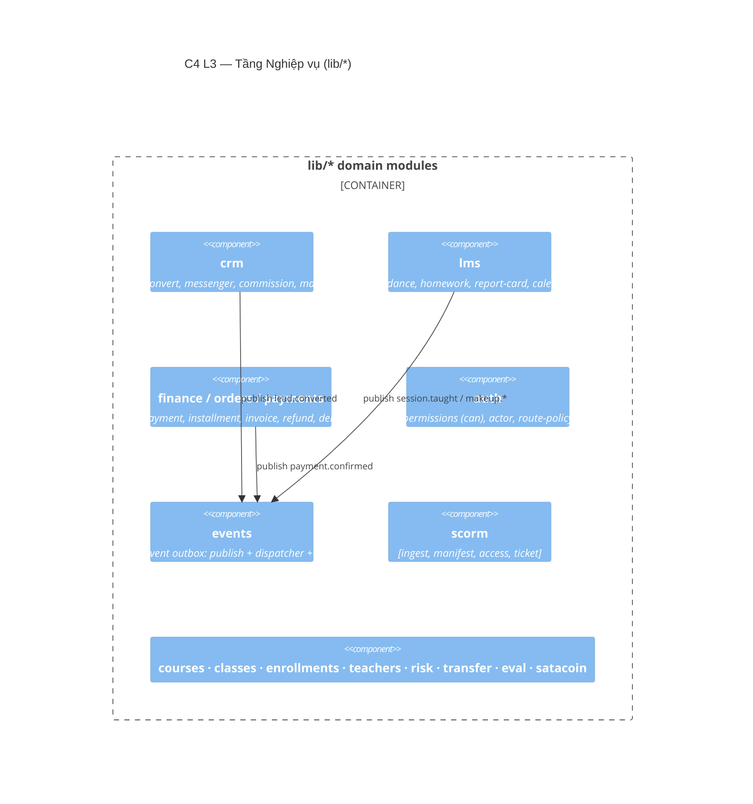

# Tầng Nghiệp vụ (Domain)

> 🚧 **Khung** — sẽ chi tiết hoá từng module nghiệp vụ ở bước 2.

**Trách nhiệm:** logic miền, quy tắc nghiệp vụ, transaction tiền/enrollment, phát DomainEvent. Đây là "trái tim" LMS.

## Bản đồ module (C4 L3 — skeleton)

## Module chính

| Module | Thư mục | Điểm nhấn |
|---|---|---|
| CRM | `lib/crm/*` | `convert-lead-v2`, `meta-webhook`, `commission`, `marketing-*` |
| LMS | `lib/lms/*` | `session-lifecycle`, `attendance-record`, `assignment`, `report-card`, `makeup`, `calendar` |
| Tài chính | `lib/finance/*`, `lib/orders/*`, `lib/payments/*` | `payment`, `installments`, `invoice-code`, `refund`, `debt` |
| Auth/RBAC | `lib/auth/*` | `permissions` (matrix `can`), `actor`, `route-policy` |
| Events | `lib/events/*` | `publish`, `register`, handlers idempotent |
| SCORM | `lib/scorm/*` | `ingest`, `manifest`, `access`, `ticket` |

## Sẽ chi tiết
- [ ] Sơ đồ component từng module + quan hệ.
- [ ] Danh mục DomainEvent + handler (xem [§8](/08-khai-niem-xuyen-suot)).
- [ ] Ranh giới `modules/*` (đích, ESLint boundary).
