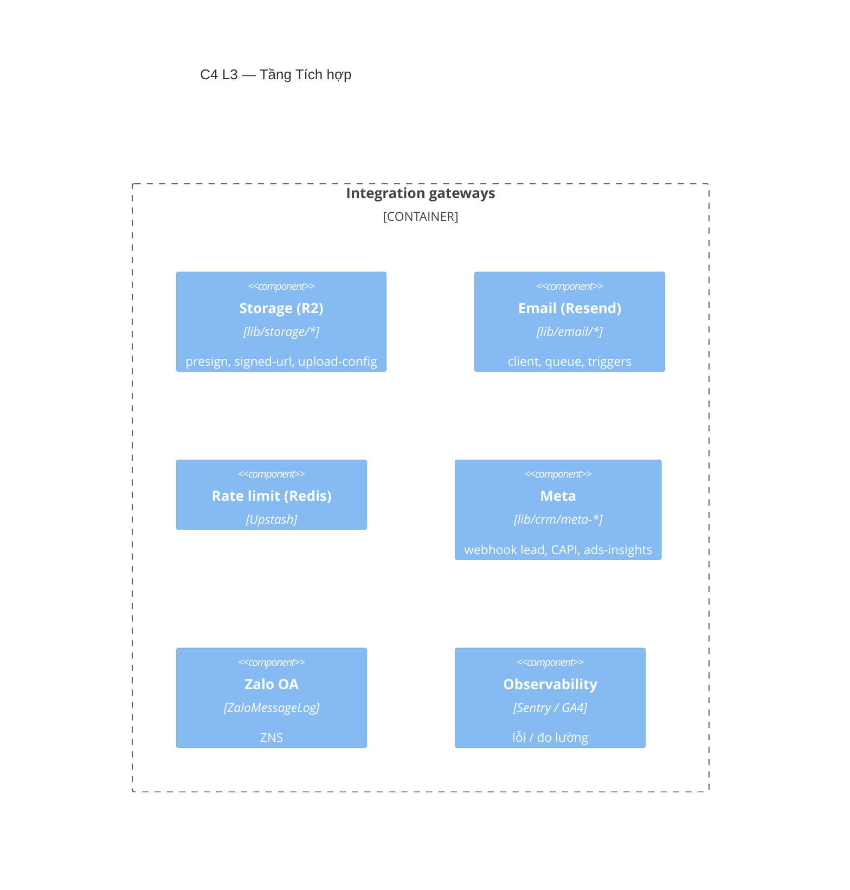

# Tầng Tích hợp (Integration)

> 🚧 **Khung** — sẽ chi tiết hoá từng cổng tích hợp ở bước 2.

**Trách nhiệm:** cổng ra hệ ngoài. Định hướng đích: **mọi external call chỉ qua `modules/integration`** (idempotent, retry, log).

## Thành phần (C4 L3 — skeleton)

## Cổng tích hợp

| Cổng | Thư mục/Model | Ghi chú |
|---|---|---|
| Cloudflare R2 | `lib/storage/*` | Presigned upload; signed-url (flag `MEDIA_SIGNED_URL`); CORS cho SCORM |
| Resend | `lib/email/*` | Gửi qua `EmailQueue` (cron) |
| Upstash Redis | rate-limit | — |
| Meta | `lib/crm/meta-webhook`, `ads-insights` | Webhook + CAPI; idempotency bắt buộc |
| Zalo OA | `ZaloMessageLog`, `lib/integration/*` | ZNS |
| Sentry / GA4 | config | server+edge / client |

## Sẽ chi tiết
- [ ] Hợp đồng từng cổng (input/output, idempotency, retry, lỗi).
- [ ] Sơ đồ luồng webhook Meta → lead → convert.
