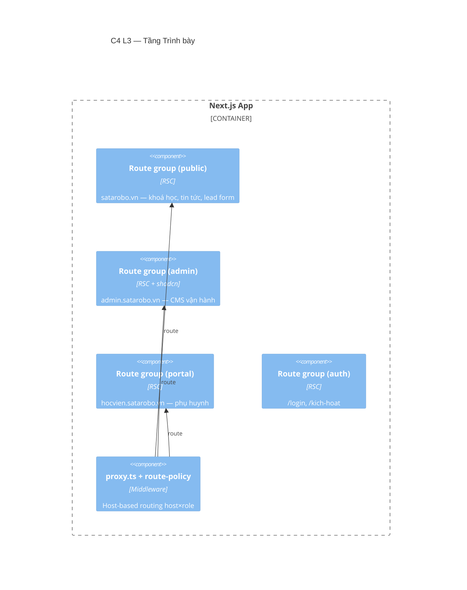

# Tầng Trình bày (Presentation)

> 🚧 **Khung** — sẽ chi tiết hoá từng route group & component ở bước 2.

**Trách nhiệm:** render UI (Server-first), điều hướng theo host, phân tách public/admin/portal/auth.

## Thành phần (C4 L3 — skeleton)

## Bản đồ thư mục

| Thư mục | Nội dung |
|---|---|
| `app/(public)` | `/`, `/khoa-hoc`, `/vinh-danh`, `/tin-tuc`, `/tuyen-dung`, `/lien-he` |
| `app/(admin)/admin` | dashboard, leads, classes, enrollments, exams, finance, kho, nhân sự… |
| `app/(portal)/portal` | ho-so, hoc-phi, lich-hoc, bai-tap, bai-thi, hoc-ba, hinh-anh, yeu-cau… |
| `app/(auth)` | login, kich-hoat |
| `components/{ui,magic,motion,charts,admin,public,…}` | thư viện UI (split theo ESLint) |
| `proxy.ts`, `lib/auth/route-policy.ts` | host-based routing (`decideRoute()`) |

## Sẽ chi tiết
- [ ] Sơ đồ điều hướng host × role (`decideRoute`).
- [ ] Danh mục trang admin & portal + gate quyền từng trang.
- [ ] UI library split & ranh giới ESLint.
