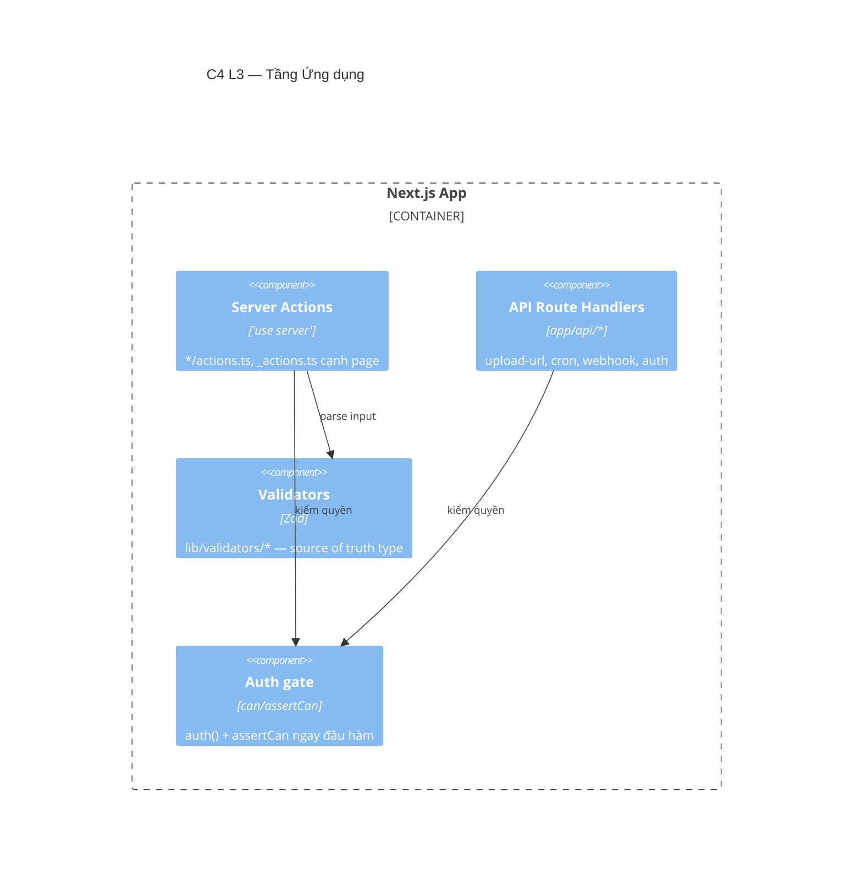

# Tầng Ứng dụng (Application)

> 🚧 **Khung** — sẽ chi tiết hoá từng nhóm Server Action & API route ở bước 2.

**Trách nhiệm:** nhận lệnh từ UI → xác thực (Zod) → kiểm quyền (`assertCan`) → gọi nghiệp vụ → revalidate. Đây là **biên giới giao dịch** (transaction boundary) của hệ.

## Thành phần (C4 L3 — skeleton)



## Quy ước Server Action (mẫu)

```typescript
'use server'
export async function createThingAction(input: unknown) {
  const session = await auth();
  if (!session?.user) return { ok: false, error: 'Chưa đăng nhập' };
  try { assertCan(session.user, 'thing:create'); }
  catch { return { ok: false, error: 'Không có quyền' }; }
  const parsed = thingSchema.safeParse(input);
  if (!parsed.success) return { ok: false, error: parsed.error.issues[0]?.message };
  // ... gọi nghiệp vụ (lib/*) trong transaction nếu đụng tiền/enrollment
  revalidatePath('/admin/things');
  return { ok: true };
}
```

## API & Webhook chính

| Nhóm | Đường dẫn | Vai trò |
|---|---|---|
| Upload | `/api/admin/upload-url`, `/api/portal/upload-url` | Presigned R2 |
| Cron | `/api/cron/*` | Email queue, SLA, dispatcher event |
| Webhook | `/api/public/webhook/*` | Meta lead, Zalo |
| Auth | `/api/auth/*` | Auth.js |
| SCORM | `/api/scorm/*`, `/api/admin/scorm/*` | runtime, asset, presign/confirm |

## Sẽ chi tiết
- [ ] Danh mục Server Action theo module + quyền + model ghi.
- [ ] Hợp đồng API (success `{ok,data,meta}` / error `{ok:false,error}`), idempotency webhook.
