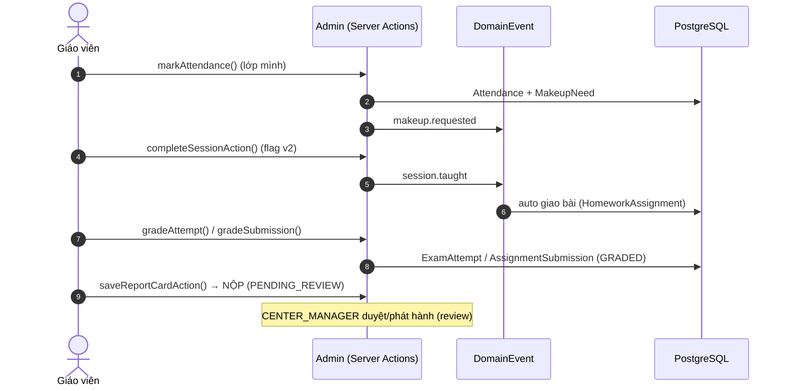

# 👩‍🏫 Luồng Giáo viên (Teacher)

> Mức: **✅ wired; vài phần sau flag**. Nơi thao tác: **admin (scope lớp mình)**. Nguồn: `docs/luong-lms-hien-trang.md` §2.

## Tóm tắt
`TEACHER` vận hành LMS ở phạm vi **hẹp**: chỉ lớp được phân công (GV chính `teacherId` hoặc trợ giảng `assistantId`). Dùng **cùng** action như `CENTER_MANAGER` nhưng bị siết bằng owner-scope (`actor.assignedClassIds` / `canManageSessionClass` / `canGradeClassWork`). GV **không** xem SĐT/email phụ huynh, **không** biên soạn nội dung LMS, **không** duyệt lớp/học bạ.

## Điểm vào chính
| Route | Mục đích |
|---|---|
| `/admin/lich` | Lịch dạy (lưới tháng) |
| `/admin/classes/[id]` | Hub lớp 7 tab |
| `/admin/teaching-materials` | Học liệu lớp mình (read-only) |
| `/admin/scorm/play/[id]` | Player SCORM (vé 10p + watermark) |
| `/admin/attendance` · `/admin/exams/[id]/attempts` · `/admin/assignments/[id]/edit` | Điểm danh · chấm thi · chấm bài |
| `/admin/students/[id]/edit` · `/admin/report-cards` · `/admin/tin-nhan` | Đánh giá năng lực · học bạ · nhắn tin PH |

## Sơ đồ động (C4 Dynamic)

## Các bước (khung)
| # | Bước | Trạng thái |
|---|---|---|
| 1 | Xem lịch dạy | 🟡 (lọc theo cơ sở, không theo lớp phân công) |
| 2 | Xem lớp được phân công (hub) | ✅ |
| 3 | Xem học liệu + SCORM | 🟡 (SCORM_ENABLED OFF) |
| 4 | Trình chiếu SCORM | 🟡 (flag OFF) |
| 5 | Điểm danh buổi | ✅ |
| 6 | Hoàn tất buổi (lifecycle v2) | 🟡 (SESSION_LIFECYCLE_V2 OFF) |
| 7 | Giao bài về nhà | ✅ |
| 8 | Chấm bài thi | ✅ |
| 9 | Chấm bài tập + rubric robotics | ✅ |
| 10 | Đánh giá năng lực robotics | ✅ |
| 11 | Đánh giá buổi (SESSION_EVAL) | ✅ |
| 12 | Nhập học bạ (chỉ nhập, không duyệt) | ✅ |
| 13 | Tạo báo cáo tiến độ lớp | ✅ |
| 14 | Nhắn tin 1-1 với phụ huynh | ✅ |
| 15 | Đề xuất sửa giáo trình | 🔴 **broken cho TEACHER** |

## ⚠️ Khoảng trống nổi bật
- 🔴 "GV đề xuất chỉnh bài" **không khả dụng** cho TEACHER (gate `questions:author` + `curriculum:edit` không cấp GV).
- 🟡 Lịch dạy lọc theo **cơ sở**, không theo lớp phân công (`lib/lms/calendar-data.ts:11`).
- 🟡 `markAttendance` bỏ qua matrix `attendance:edit` (dùng `requireTeacherOrAdmin` đọc `user.role` đơn).
- 🟡 2 tính năng cốt lõi (hoàn tất buổi v2, SCORM) khoá sau flag mặc định OFF.

> 🚧 **Chi tiết từng bước** với `file:line` đang được bổ sung ở bước 2.
