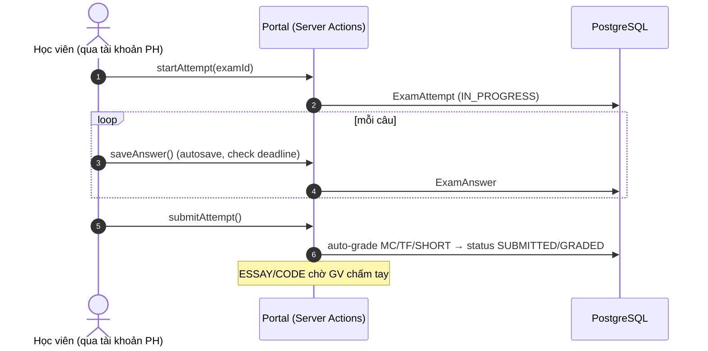

# 🧒 Luồng Học viên (truy cập qua cổng phụ huynh)

> Mức: **🟡 đọc nhiều; tương tác = nộp bài + làm thi**. Nơi thao tác: **portal phụ huynh**. Nguồn: `docs/luong-lms-hien-trang.md` §4.

## Tóm tắt
Học viên **không có tài khoản đăng nhập riêng** (xác minh: chỉ provider `Credentials`, không role `STUDENT`; `getPortalContext` chỉ chấp nhận `PARENT`). Phụ huynh đăng nhập, chọn "con đang xem" qua cookie ký HMAC; "chế độ Học viên" chỉ là cookie `portal_view`. Hai tương tác thực sự được wired: **nộp bài tập** (Assignment) và **làm bài thi** (Exam/ExamAttempt); còn lại đa số là đọc.

## Điểm vào chính
| Route | Mục đích |
|---|---|
| `/portal/bai-tap`, `/portal/bai-tap/[assignmentId]` | Nộp bài tập (text + file) |
| `/portal/bai-thi`, `/portal/bai-thi/[examId]` | Làm bài thi (autosave + nộp) |
| `/portal/bai-giang` · `/portal/ket-qua` · `/portal/hoc-ba` | Bài giảng · kết quả · học bạ (PUBLISHED) |
| `/portal/satacoin` · `/portal/lich-hoc` · `/portal/ho-so-con` | Coin · lịch · hồ sơ con |

## Sơ đồ động — làm bài thi (C4 Dynamic)

## Các bước (khung)
| # | Bước | Trạng thái |
|---|---|---|
| 1 | PH đăng nhập + chọn con (cookie ký) | ✅ |
| 2 | Nộp bài tập (Assignment) | ✅ |
| 3 | Xem "bài kiểm tra được giao" (HomeworkAssignment) | 🟡 read-only |
| 4 | Làm bài thi (Exam) | ✅ |
| 5 | Xem bài giảng + tải tài liệu | ✅ (⚠️ tài liệu lộ URL thô) |
| 6 | Xem kết quả học tập | ✅ |
| 7 | Xem học bạ (PUBLISHED) | ✅ |
| 8 | Xem SataCoin | ✅ (earn theo rule chưa nối) |
| 9 | Lịch · nhận xét · hình ảnh | ✅ |
| 10 | Hồ sơ con | ✅ |
| 11 | SCORM (học liệu GV, không hướng HV) | 🧩 không có UI portal (đúng chủ đích) |

## ⚠️ Khoảng trống nổi bật
- 🔴 `HomeworkAssignment.status` **không bao giờ chuyển** (tạo `ASSIGNED` qua `createMany`, không update) → trang `lam-bai` chỉ đọc.
- 🟡 Gamification rule-based chưa nối (`grantByRule()` không caller).
- 🟡 Tài liệu bài giảng lộ `fileUrl` thô (không presign).

> 🚧 **Chi tiết từng bước** với `file:line` đang được bổ sung ở bước 2.
