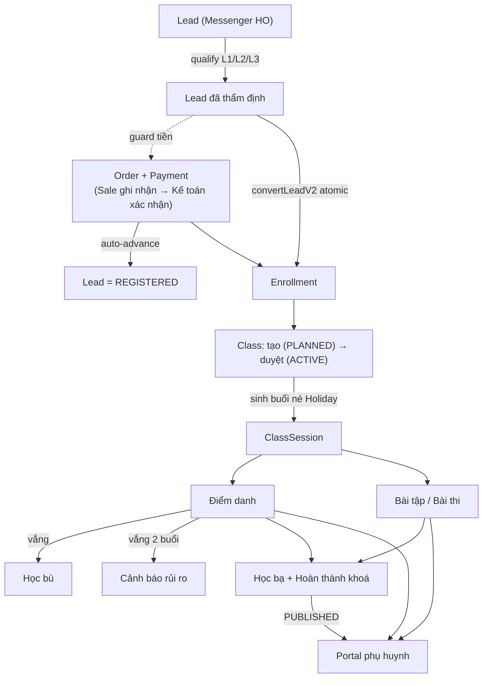

# 6. Runtime View — Các luồng LMS

> arc42 §6 — *Runtime View* · **C4 Dynamic**. Hành vi hệ thống theo thời gian, tổ chức theo **vai trò người dùng**. Nội dung bám sát `docs/luong-lms-hien-trang.md` (đối chiếu code, có bằng chứng `file:line`).

## 6.0 Pipeline end-to-end (lead → lớp → portal)

## 6.1 Các luồng theo vai trò

| # | Luồng | Nơi thao tác | Mức hoàn thiện |
|---|---|---|---|
| 1 | [🎓 Phòng Đào tạo](./phong-dao-tao) | admin | ✅ phần lớn wired |
| 2 | [👩‍🏫 Giáo viên](./giao-vien) | admin (scope lớp mình) | ✅ wired; vài phần sau flag |
| 3 | [🏫 Quản lý Lớp học](./quan-ly-lop) | admin (hub `classes/[id]`) | ✅ wired |
| 4 | [🧒 Học viên](./hoc-vien) | qua portal phụ huynh | 🟡 đọc nhiều; tương tác = nộp bài + thi |
| 5 | [👪 Phụ huynh](./phu-huynh) | portal | ✅ wired |
| 6 | [🦴 Xương sống & RBAC](./xuong-song-rbac) | toàn hệ | ✅ wired (PH‑1/PH‑2 đã fix, chưa commit) |

## 6.2 Ai chạm khâu nào

| Khâu | Đào tạo | GV | QL lớp | Học viên | Phụ huynh |
|---|:--:|:--:|:--:|:--:|:--:|
| Khoá · giáo trình · đề thi | ✅ tạo | xem/đề xuất | — | — | — |
| Tạo lớp · ghi danh · duyệt | ✅ | — | ✅ duyệt | — | — |
| Sinh buổi · học bù · chuyển lớp | ✅ | — | ✅ | — | xem |
| Điểm danh · hoàn tất buổi · giao bài | hỗ trợ | ✅ lớp mình | ✅ cơ sở | — | xem |
| Chấm thi/bài · học bạ | review/phát hành | ✅ chấm/soạn | ✅ | — | xem (PUBLISHED) |
| Làm bài tập · làm thi | — | — | — | ✅ | bật giúp con |

:::info 🚧 Khung
Mỗi trang luồng có: tóm tắt · vai trò · điểm vào · sơ đồ động (C4 Dynamic) · bảng bước. **Chi tiết từng bước** (file:line, action, quyền, model, event) đang được port đầy đủ ở bước 2.
:::
