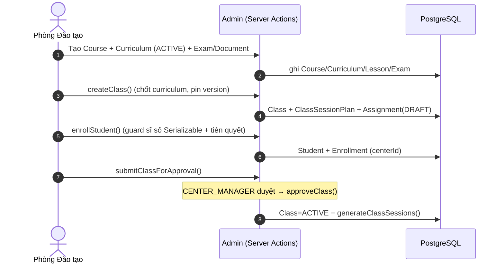

# 🎓 Luồng Phòng Đào tạo (Training / Academic Admin)

> Mức: **✅ phần lớn wired**. Nơi thao tác: **admin**. Nguồn: `docs/luong-lms-hien-trang.md` §1.

## Tóm tắt
Phòng Đào tạo (role `TRAINING` — khác `TEACHER`) chuẩn bị toàn bộ "khung học thuật" trước khi lớp chạy: danh mục khoá → giáo trình/buổi → ngân hàng đề/tài liệu/template → tạo lớp (snapshot giáo trình, tự sinh kế hoạch buổi + bài tập DRAFT) → ghi danh (guard sĩ số + tiên quyết) → quy trình duyệt lớp.

## Vai trò RBAC liên quan
`SUPER_ADMIN` · `TRAINING` · `CENTER_MANAGER` (duyệt + quản lý ghi danh theo cơ sở) · `SALES_CSM` (ghi danh + học thử) · `TEACHER` (chấm/đánh giá lớp mình).

## Điểm vào chính
| Route | Mục đích |
|---|---|
| `/admin/courses`, `/admin/course-packages` | Khoá · gói/combo · ưu đãi |
| `/admin/curriculums` | Giáo trình + buổi + duyệt đề xuất sửa |
| `/admin/exams`, `/admin/documents` | Đề thi · ngân hàng câu hỏi · tài liệu |
| `/admin/classes`, `/admin/class-groups` | Tạo/duyệt/chạy lớp · nhóm lớp |
| `/admin/enrollments`, `/admin/students` | Ghi danh · học viên |
| `/admin/trial-classes`, `/admin/leads/[id]/convert` | Lớp học thử · convert lead |
| `/admin/bao-cao/dao-tao` | Báo cáo đào tạo |

## Sơ đồ động (C4 Dynamic)

## Các bước (khung)
| # | Bước | Trạng thái |
|---|---|---|
| 1 | Thiết lập khoá (Course/Discount/Prerequisite) | ✅ |
| 2 | Soạn giáo trình (Curriculum/Lesson/LessonChangeRequest) | ✅ |
| 3 | Ngân hàng câu hỏi/đề/tài liệu | ✅ |
| 4 | Tạo lớp + sinh kế hoạch buổi + bài tập DRAFT | ✅ |
| 5 | Ghi danh (guard sĩ số + tiên quyết) | ✅ |
| 6 | Duyệt lớp → sinh buổi thật | ✅ |
| 7 | Chạy lớp: điểm danh · học bù · giao bài | ✅ |
| 8 | Chấm thi & bài tập (GV lớp mình) | ✅ |
| 9 | Đánh giá năng lực + phiếu buổi | ✅ |
| 10 | Học bạ + hoàn thành khoá (cert) | ✅ |
| 11 | Lớp học thử V2 + convert lead | ✅ |
| 12 | Báo cáo đào tạo | ✅ |

## ⚠️ Khoảng trống nổi bật
- `convertLeadV2` **không** re-check sĩ số + **không** check tiên quyết (`lib/crm/convert-lead-v2.ts:194`).
- `TRAINING` **không** có quyền duyệt/phát hành `ReportCard` lẫn `CourseCompletion` (`permissions.ts:382,390,391`).
- 2 hệ TrialClass (V1 + V2) song song.

> 🚧 **Chi tiết từng bước** (UI · action · quyền · model · event với `file:line`) đang được bổ sung ở bước 2.
