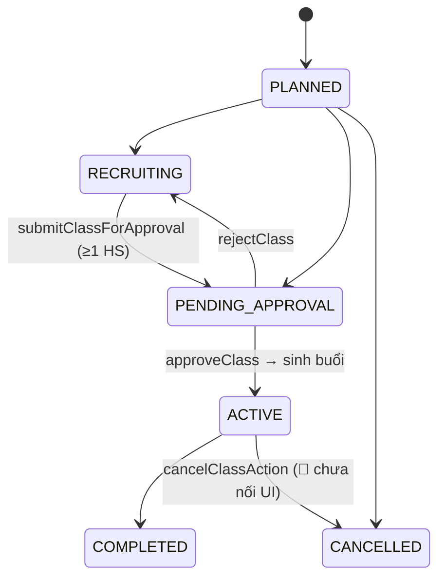

# 🏫 Luồng Quản lý Lớp học (Class Operations / Lifecycle)

> Mức: **✅ wired**. Nơi thao tác: **admin (hub `classes/[id]`)**. Nguồn: `docs/luong-lms-hien-trang.md` §3.

## Tóm tắt
Vòng đời lớp: tạo (PLANNED) → tuyển sinh (RECRUITING) → gửi duyệt (PENDING_APPROVAL) → duyệt (ACTIVE, tự sinh buổi) → chạy buổi → kết thúc (COMPLETED) / huỷ (CANCELLED). Trung tâm là **hub `classes/[id]` với 7 tab** (Thông tin · Chương trình · Buổi & Điểm danh · Ảnh · Học bù · SCORM · Đánh giá). Mọi mutation qua `scopedDb`/`passesScope` để cách ly cơ sở.

## Vòng đời lớp (state machine)

## Điểm vào chính
| Route | Mục đích |
|---|---|
| `/admin/classes/[id]` | Hub 7 tab |
| `/admin/classes/[id]/students` · `/progress` | Roster · tiến độ + báo cáo |
| `/admin/hoc-bu` · `/admin/chuyen-lop` | Học bù · chuyển lớp/cơ sở |
| `/admin/hoan-thanh-khoa` | Hoàn thành khoá + chứng chỉ |
| `/admin/canh-bao-rui-ro` · `/admin/cham-soc-hv` | Cảnh báo rủi ro · care task |

## Các bước (khung)
| # | Bước | Trạng thái |
|---|---|---|
| 1 | Tạo lớp (pin curriculum, sinh plan + Assignment DRAFT) | ✅ |
| 2 | Phê duyệt lớp (3 trạng thái) | ✅ |
| 3 | Sinh buổi học (né Holiday) | ✅ |
| 4 | Điểm danh (kéo theo học bù + rủi ro + thông báo) | ✅ |
| 5 | Hoàn tất buổi (lifecycle v2) | 🟡 (flag) |
| 6 | Điều chỉnh / huỷ buổi | ✅ |
| 7 | Đổi lịch lớp & dời buổi | ✅ |
| 8 | Gán / bỏ học viên | ✅ |
| 9 | Giáo trình lớp | ✅ |
| 10 | Học bù (gợi ý liên cơ sở → xếp → hoàn tất) | ✅ |
| 11 | Cảnh báo rủi ro & chăm sóc | ✅ |
| 12 | Tiến độ lớp & báo cáo PH | ✅ |
| 13 | Hoàn thành khoá + chứng chỉ | ✅ |
| 14 | Chuyển lớp / cơ sở | ✅ |
| 15 | Nhóm lớp (ClassGroup) | ✅ |
| 16 | Tab Ảnh / SCORM / Đánh giá | 🟡 (gate quyền/flag) |

## ⚠️ Khoảng trống nổi bật
- 🔴 `cancelClassAction` (hủy lớp + refund + rút enrollment + huỷ buổi) **chưa nối UI** (`classes/_actions.ts:754`); hiện chỉ có `deleteClass` (soft-delete).
- Đếm sĩ số ứng viên học bù **liên cơ sở** dùng `db` trần + advisory lock.

> 🚧 **Chi tiết từng bước** với `file:line` đang được bổ sung ở bước 2.
