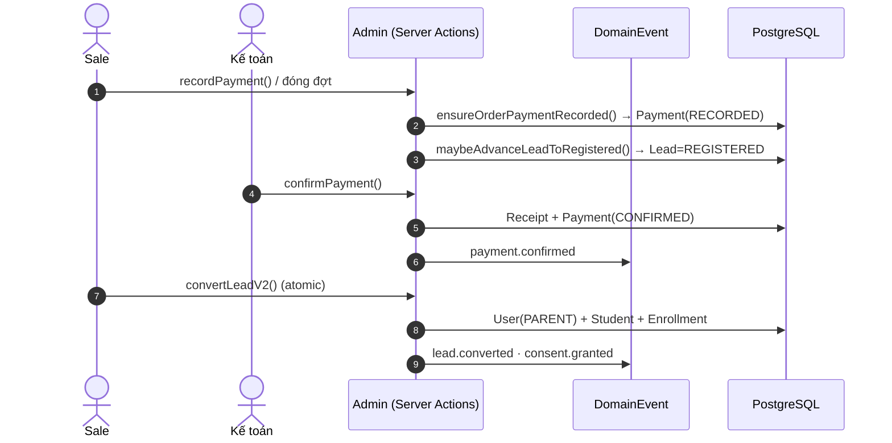

# 🦴 Luồng Xương sống & RBAC (cross-cutting)

> Mức: **✅ wired** (PH‑1/PH‑2 đã fix ở working tree, **chưa commit**). Nguồn: `docs/luong-lms-hien-trang.md` §6.

## Tóm tắt
Lớp nền xuyên suốt: ma trận quyền tĩnh (`lib/auth/permissions.ts`, ~150 action × 9 role) + cổng cách ly cơ sở `scopedDb` + outbox `DomainEvent`, đỡ cho pipeline Lead → convert → Order/Payment → Enrollment → Class → ClassSession → Attendance → ReportCard → Portal.

## Sơ đồ động — tiền & ghi danh (C4 Dynamic)

## Các trụ (khung)
| # | Trụ | Trạng thái |
|---|---|---|
| 1 | RBAC tĩnh — `can()` / `assertCan()` | ✅ |
| 2 | RBAC động (RoleDef/RolePermission/UserOrgRole) + UI `/admin/roles` | ✅ (scopeType chưa áp triệt để mọi page) |
| 3 | `scopedDb` — cách ly cơ sở | ✅ đọc / 🔴 write chưa auto-scope |
| 4 | Lead pipeline + transition guard | ✅ |
| 5 | Order + Payment 2 sổ → hợp nhất (PH‑1) | ✅ |
| 6 | Convert → Enrollment (atomic) | ✅ |
| 7 | Báo cáo học bạ (ReportCard) | ✅ |
| 8 | Portal học phí (chỉ CONFIRMED) | ✅ |
| 9 | DomainEvent outbox (15 nhóm handler) | ✅ |

## ⚠️ Khoảng trống nổi bật
- 🔴 `scopedDb` **chưa auto-scope WRITE** + nested include → cần `passesScope` thủ công (IDOR write).
- 🟡 `Attendance` / `ReportCard` còn ở `SCOPE_EXEMPT` (chưa scope tầng query).
- 🟡 `REGISTERED` thiếu khỏi `KANBAN_COLUMNS` (chỉ auto-advance).
- ⚠️ Fix PH‑1/PH‑2/C4/C5 + migration `20260629142518_lead_payment_enroll_fields` đang ở **working tree, chưa commit**.

> 🚧 **Chi tiết từng trụ** với `file:line` đang được bổ sung ở bước 2.
