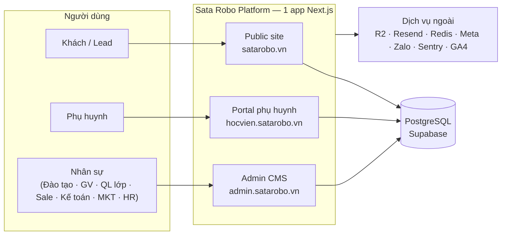

# Tài liệu Kiến trúc Sata Robo

Trình bày kiến trúc nền tảng **Sata Robo VN** — *brand hub + admin CMS + portal phụ huynh* cho trung tâm giáo dục robotics (Đà Nẵng) — theo chuẩn **[arc42](https://arc42.org/)** với các view **[C4](https://c4model.com/)** (Context → Container → Component → Deployment) vẽ bằng Mermaid.

:::tip Cách đọc
- **Mới bắt đầu?** Đọc lần lượt [§1 Giới thiệu & Mục tiêu](/01-gioi-thieu-muc-tieu) → [§3 Bối cảnh (C4 L1)](/03-pham-vi-boi-canh) → [§5 Khối xây dựng (C4 L2/L3)](/05-khoi-xay-dung).
- **Quan tâm nghiệp vụ?** Vào thẳng [§6 Runtime — các luồng LMS theo vai trò](/06-runtime-luong).
- **Quan tâm hạ tầng/triển khai?** Vào [§7 Triển khai — chi tiết từng container](/07-trien-khai).
:::

## Hệ thống trong một sơ đồ

## Bản chất kiến trúc (tóm tắt)

| Khía cạnh | Quyết định |
|---|---|
| Kiểu hệ thống | **Modular monolith** — 1 app Next.js, KHÔNG microservice, KHÔNG message broker |
| Phân tách | 4 route group: `public` · `admin` · `portal` · `auth` (host-based routing qua `proxy.ts`) |
| Dữ liệu | PostgreSQL (Supabase) + Prisma 5 · 200+ models · cách ly cơ sở qua `scopedDb` |
| Bất đồng bộ | **DB-backed queue + Vercel Cron** + **DomainEvent outbox** (handler idempotent) |
| Quyền | RBAC: matrix tĩnh `can()` + RBAC động (RoleDef/UserOrgRole) · 9 vai trò |
| Tổ chức | OrgUnit tree: ROOT → HO · CS1 · CS2 (độc lập ngang hàng) |

## Quy ước ký hiệu trạng thái

Mỗi tính năng/bước trong tài liệu được gắn nhãn mức độ hoàn thiện (đối chiếu code thực tế):

| Nhãn | Ý nghĩa |
|---|---|
| ✅ **wired** | Đã nối UI ↔ action ↔ DB, chạy được |
| 🟡 **partial** | Có nhưng sau feature-flag / thiếu phần / còn 2 luồng song song |
| 🧩 **schema-only** | Mới có model, chưa có UI/action |
| 🔴 **broken** | Có nhưng đứt mạch |
| ❓ **chưa xác minh** | Chưa kiểm chứng chắc chắn |

:::info Tình trạng tài liệu
🚧 Đang xây theo 2 bước: **(1) khung** (cấu trúc + sơ đồ C4 tổng + skeleton) → **(2) chi tiết** từng tầng & từng luồng. Trang còn skeleton có nhãn 🚧 ở đầu.
:::
